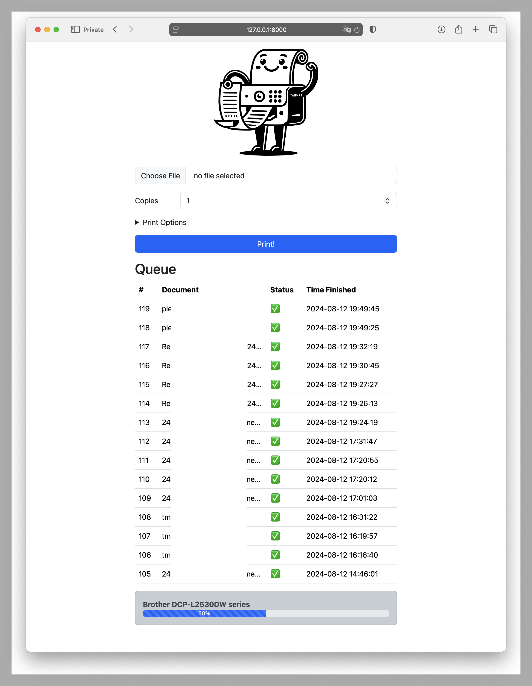

# Pleaseprint

Simple web interface to print files on a printer. It's designed to run on an embedded device like a Raspberry Pi which is connected to a single printer. A [CUPS](https://www.cups.org/) server is required to be running on the device.

It's written in Python using [FastAPI](https://fastapi.tiangolo.com/) and [pycups](https://pypi.org/project/pycups/).



## Installation

Installing and setting up CUPS is beyond the scope of this README. Please refer to the CUPS documentation. To test the printer run a command like the following:

```bash
lp /etc/hosts
```

To install the Python dependencies run:

```bash
poetry install
```

## Running

To run the server:

```bash
poetry run fastapi run
```

The server will be listening on all interface on port 8000.

## Usage

The webinterface should be self-explanatory. Just upload a file and press the print button. The file will be sent to the default printer. You may specify extra options like the number of copies or the page range.

## Future

If the project is of use this year, it may be extended to support more features like selecting and managing the printer settings, authentication, and more.

## License

This project is licensed under the MIT License - see the [LICENSE](LICENSE) file for details.
